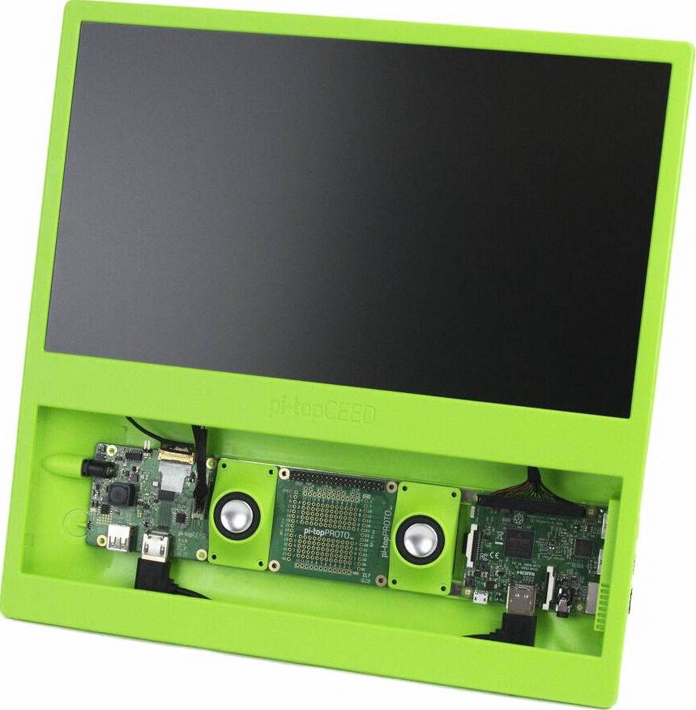
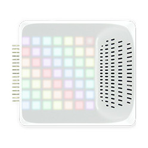
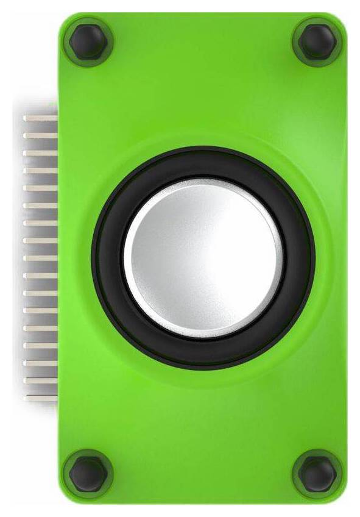

pi-top Python SDK (Preview)
===========================

This SDK is currently pre-release
---------------------------------

This SDK is currently in active development, and is made publicly
available to inspect while it is being developed.

Please do not expect anything to be final, working or understandable
until it has matured, ready for release.

Build Status: Latest
--------------------

A simple, modular interface for interacting with a pi-top and its
related accessories and components.

Supports all pi-top devices:

Supports all pi-top peripherals:

Support's pi-top Maker Architecture (PMA):

About
-----

This library is installed as a Python 3 module called pitop. It includes several submodules that
allow you to easily interact with most of the hardware inside a pi-top.

You can easily connect different components of the system using the
modules available in the library:

    from time import sleep
    from pitop.pma import UltrasonicSensor
    from pitop.miniscreen import OLED

    oled = OLED()
    utrasonic = PMAUltrasonicSensor("D1")

    while True:
        distance = utrasonic.distance
        oled.draw_multiline_text(str(distance))
        sleep(0.1)

This repository also contains CLI utilities, to communicate with your
pi-top using the terminal.

    $ pt-oled "Hey! I'm a $(pt-host)"

See the [Recipes](https://pitop.readthedocs.io/en/stable/recipes.html)
chapter of the documentation for ideas on how to get started.

Backwards Compatibility
-----------------------

When this library reaches v1.0.0, we will aim to maintain
backwards-compatibility thereafter. Until then, every effort will be
made to ensure stable support, but it cannot be guaranteed. Breaking
changes will be clearly documented.

Requirements
------------

The following packages are required in your device for this library to
work.

| Package Name           | Usage                                                                                                                                                                       |
|------------------------|-----------------------------------------------------------------------------------------------------------------------------------------------------------------------------|
| `alsa-utils`           | Used for configuring the system audio; such as setting the correct audio card when connecting a pi-topSPEAKER.                                                              |
| `coreutils`            | Used to perform basic OS operations and commands; such as `ls` and `chmod`                                                                                                  |
| `fonts-droid-fallback` | Minimum essential font used by the OLED screen.                                                                                                                             |
| `i2c-tools`            | Communicate with pi-top I2C devices.                                                                                                                                        |
| `pt-device-manager`    | Allows communication with pi-top's hub; such as getting battery state. This package installs a `systemd` service that needs to be running for this library to work properly |
| `raspi-config`         | Required to communicate and set parameters to the Raspberry Pi.                                                                                                             |

Installation
------------

The pi-top Python SDK is installed out of the box with pi-topOS, which
is available from [pi-top.com](https://www.pi-top.com/products/os/). To
install on Raspberry Pi OS or other operating systems, see the
[Installing](https://pitop.readthedocs.io/en/stable/installing.html)
chapter.

Documentation
-------------

Comprehensive documentation is available at
<https://pitop.readthedocs.io/>. Please refer to the
[Contributing](https://pitop.readthedocs.io/en/stable/contributing.html)
and
[Development](https://pitop.readthedocs.io/en/stable/development.html)
chapters in the documentation for information on contributing to the
project.

Contributors
------------

See the [contributors
page](https://github.com/pi-top/pitop/graphs/contributors) on GitHub for
more info.
