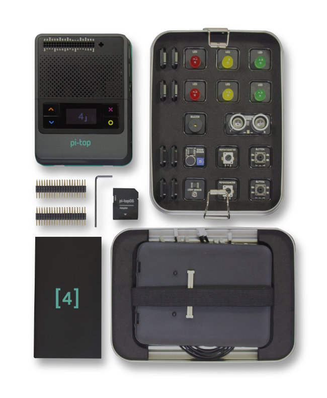

=====================================================
pi-top Python API
=====================================================

.. image:: https://badge.fury.io/gh/pi-top%2Fpitop.svg
    :target: https://badge.fury.io/gh/pi-top%2Fpitop
    :alt: Source code on GitHub

.. image:: https://badge.fury.io/py/pitop.svg
    :target: https://badge.fury.io/py/pitop
    :alt: Latest Version

A simple interface to interact with pi-top components and add-ons.

-----
About
-----

This library is installed as a python 3 module called `pitop`. It includes several
submodules that allow you to easily interact with most of the hardware inside a pi-top.

See the `Recipes`_ chapter of the documentation for ideas on how to get started.

.. _Recipes: https://pitop.readthedocs.io/en/stable/recipes.html

------------------------
Submodules overview
------------------------

pitop.core
========================

Contains a collection of common classes and modules used by pi-top Python-based software.

pitop.case_buttons
========================

Classes to interact with pi-top [4]'s case buttons.

.. code-block:: python

    from pitop.case_buttons import PTUpButton, PTDownButton

    up = PTUpButton()
    down = PTDownButton()

    def up_action():
        print ("UP is pressed")

    def down_action():
        print ("DOWN is pressed")

    up.when_pressed = up_action
    down.when_pressed = down_action

pitop.keyboard
========================

Provides the functionality to use key presses as buttons, as a drop-in replacement for a GPIO button.

pitop.oled
========================

Module for interacting with the pi-top [4]'s OLED screen

.. code-block:: python

    from pitop.oled import PTOLEDDisplay
    from time import sleep

    oled_screen = PTOLEDDisplay()
    oled_screen.draw_image_file("wave.png")
    sleep(2)

pitop.pma
========================

A module for interacting with the pi-top [4]'s Maker Architecture (PMA) components, such as
LED's, buzzers and motors.

.. code-block:: python

    from pitop.pma import Button, LED
    from time import sleep

    button = Button("D1")
    led = LED("D2")

    # Connect button to LED
    button.when_pressed = led.on
    button.when_released = led.off

    # Wait for Ctrl+C to exit
    try:
        while True:
            sleep(1)
    except KeyboardInterrupt:
        pass

pitop.protoplus
========================

pitop.pulse
========================

Communicate with the pi-topPULSE addon board

-------------
Requirements
-------------

+---------------------------+-----------------------------------------------------------------------------------------------------------------------+
| Package Name              | Usage                                                                                                                 |
+===========================+=======================================================================================================================+
| `alsa-utils`              | Used for configuring the system audio; such as setting the correct audio card when connecting a pi-topSPEAKER.        |
+---------------------------+-----------------------------------------------------------------------------------------------------------------------+
| `coreutils`               | Used to perform basic OS operations and commands; such as `ls` and `chmod`                                            |
+---------------------------+-----------------------------------------------------------------------------------------------------------------------+
| `fonts\-droid\-fallback`  | Minimum essential font used by the OLED screen.                                                                       |
+---------------------------+-----------------------------------------------------------------------------------------------------------------------+
| `i2c-tools`               | Communicate with pi-top I2C devices.                                                                                  |
+---------------------------+-----------------------------------------------------------------------------------------------------------------------+
| `pt-device-manager`       | Allows communication with pi-top's hub; such as getting battery state.                                                |
|                           | This package installs a `systemd` service that needs to be running for this library to work properly                  |
+---------------------------+-----------------------------------------------------------------------------------------------------------------------+
| `raspi-config`            | Required to communicate and set parameters to the Raspberry Pi.                                                       |
+---------------------------+-----------------------------------------------------------------------------------------------------------------------+

-------------
Installation
-------------

The pi-top python API is installed by default in the pi-topOS desktop image, available from
pi-top.com_. To install on Raspberry Pi OS or other operating systems, see the `Installing`_ chapter.

.. _pi-top.com: https://www.pi-top.com/products/os/
.. _Installing: https://pitop.readthedocs.io/en/stable/installing.html

-------------
Documentation
-------------

Comprehensive documentation is available at https://pitop.readthedocs.io/.
Please refer to the `Contributing`_ and `Development`_ chapters in the
documentation for information on contributing to the project.

.. _Contributing: https://pitop.readthedocs.io/en/stable/contributing.html
.. _Development: https://pitop.readthedocs.io/en/stable/development.html

-------------
Contributors
-------------

See the `contributors page`_ on GitHub for more info.

.. _contributors page: https://github.com/pi-top/pitop/graphs/contributors
