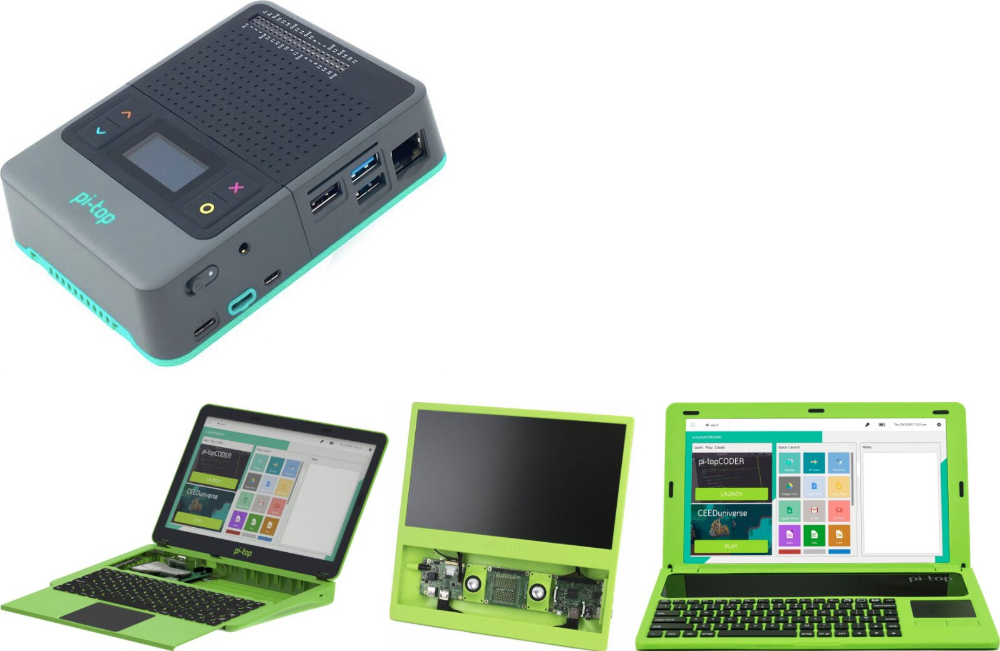
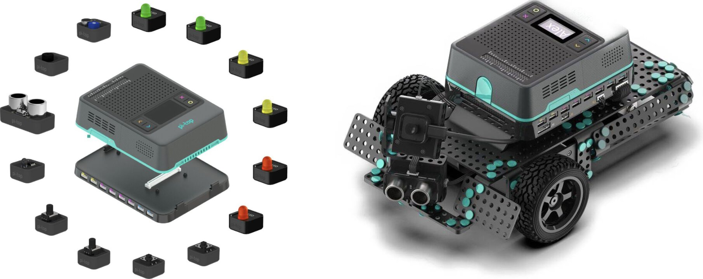
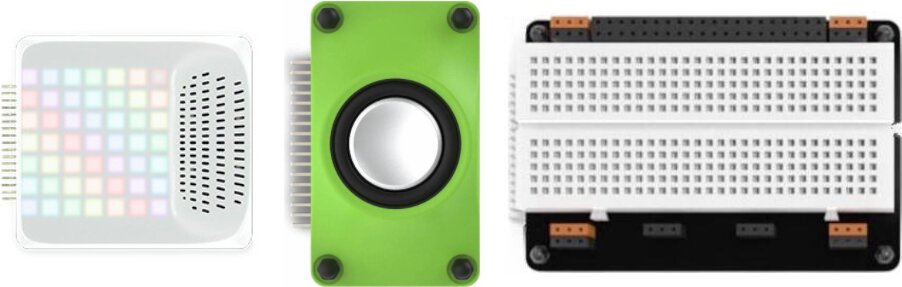

===========================
pi-top Python SDK (Preview)
===========================

A simple, modular interface for interacting with a pi-top and its related accessories and components.

Supports all pi-top devices:

Supports pi-top Maker Architecture (PMA):

Supports all pi-top peripherals:

--------------------------
Status: Active Development
--------------------------

This SDK is currently in active development, and is made publicly available to inspect while it is being developed.

Please do not expect anything to be final, working or understandable until it has matured, ready for release.

Backwards Compatibility
=======================

When this library reaches v1.0.0, we will aim to maintain backwards-compatibility thereafter. Until then, every effort will be made to ensure stable support, but it cannot be guaranteed. Breaking changes will be clearly documented.

--------------------
Build Status: Latest
--------------------

.. image:: https://img.shields.io/github/workflow/status/pi-top/pi-top-Python-SDK/Build,%20Test%20and%20Publish
   :alt: GitHub Workflow Status

.. image:: https://img.shields.io/github/v/release/pi-top/pi-top-Python-SDK
    :alt: GitHub release (latest by date)

.. image:: https://img.shields.io/pypi/v/pitop
   :alt: PyPI release

.. image:: https://readthedocs.com/projects/pi-top-pi-top-python-sdk/badge/?version=latest&token=13589f150cf192dcfc6ebfd53aae33164450aafd181c5e49018a21fd93149127
    :target: https://docs.pi-top.com/python-sdk/latest/?badge=latest
    :alt: Documentation Status

.. # TODO - add coverage report
.. image: https://codecov.io/gh/pi-top/pi-top-Python-SDK/branch/master/graph/badge.svg?token=hfbgB9Got4
..     :target: https://codecov.io/gh/pi-top/pi-top-Python-SDK
..     :alt: Coverage

-----
About
-----

This SDK aims to provide an easy-to-use framework for managing a pi-top. It includes a Python 3 package (`pitop`),

with several modules for interfacing with a range of pi-top devices and peripherals It also contains CLI utilities,
to interact with your pi-top using the terminal.

The SDK is included out-of-the-box with pi-topOS.

Ensure that you keep your system up-to-date to enjoy the latest features and bug fixes.

This library is installed as a Python 3 module called `pitop`. It includes several
submodules that allow you to easily interact with most of the hardware inside a pi-top.

You can easily connect different components of the system using the
modules available in the library:

.. code-block:: python

    from time import sleep
    from pitop.pma import UltrasonicSensor
    from pitop.miniscreen import OLED

    oled = OLED()
    utrasonic = PMAUltrasonicSensor("D1")

    while True:
        distance = utrasonic.distance
        oled.draw_multiline_text(str(distance))
        sleep(0.1)

This repository also contains CLI utilities, to communicate with your pi-top using the terminal.

.. code-block:: bash

    $ pt-oled "Hey! I'm a $(pt-host)"

See the `Basic Examples`_ chapter of the documentation for ideas on how to get started.

.. _Basic Examples: https://pi-top-pi-top-python-sdk.readthedocs-hosted.com/en/latest/examples_api_basic.html

------------
Installation
------------

The pi-top Python SDK is installed out of the box with pi-topOS, which is available from
pi-top.com_. To install on Raspberry Pi OS or other operating systems, see the `Getting Started`_ chapter.

.. _pi-top.com: https://www.pi-top.com/products/os/
.. _Getting Started: https://pi-top-pi-top-python-sdk.readthedocs-hosted.com/en/latest/getting_started.html

-------------
Documentation
-------------

Comprehensive documentation is available here_

.. _here: https://pi-top-pi-top-python-sdk.readthedocs-hosted.com/en/latest/getting_started.html

------------
Contributing
------------

Please refer to the `Contributing`_ document in this repository
for information on contributing to the project.

.. _Contributing: https://github.com/pi-top/pi-top-Python-SDK/blob/master/.github/CONTRIBUTING.md

See the `contributors page`_ on GitHub for more info on contributors.

.. _contributors page: https://github.com/pi-top/pitop/graphs/contributors
