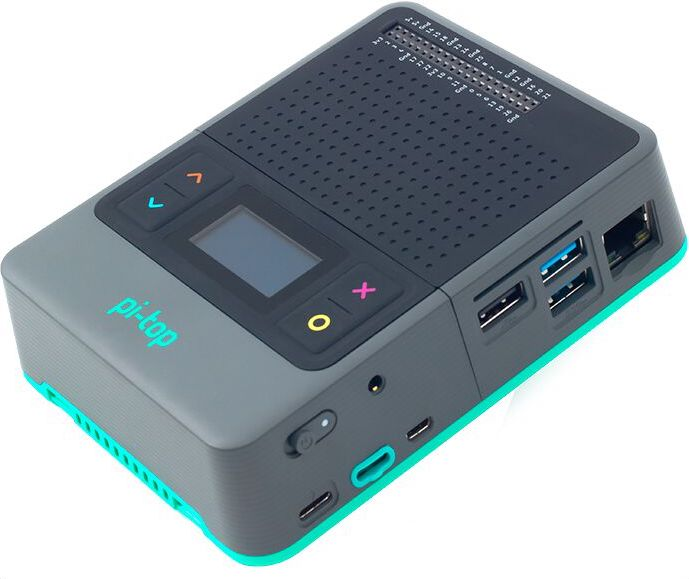
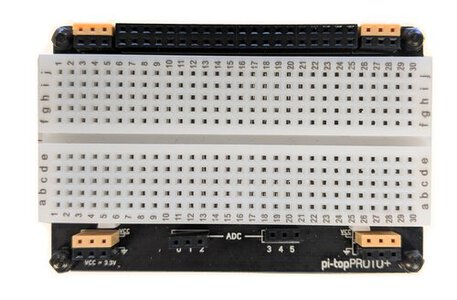

===========================
pi-top Python SDK (Preview)
===========================

---------------------------------
This SDK is currently pre-release
---------------------------------

This SDK is currently in active development, and is made publicly available to inspect while it is being developed.

Please do not expect anything to be final, working or understandable until it has matured, ready for release.

--------------------
Build Status: Latest
--------------------

.. image:: https://img.shields.io/github/workflow/status/pi-top/pi-top-Python-SDK/Build,%20Test%20and%20Publish
   :alt: GitHub Workflow Status

.. image:: https://img.shields.io/github/v/release/pi-top/pi-top-Python-SDK
    :alt: GitHub release (latest by date)

.. image:: https://img.shields.io/pypi/v/pitop
   :alt: PyPI release

.. image:: https://readthedocs.com/projects/pi-top-pi-top-python-sdk/badge/?version=latest&token=13589f150cf192dcfc6ebfd53aae33164450aafd181c5e49018a21fd93149127
    :target: https://docs.pi-top.com/python-sdk/latest/?badge=latest
    :alt: Documentation Status

.. # TODO - add coverage report
.. image: https://codecov.io/gh/pi-top/pi-top-Python-SDK/branch/master/graph/badge.svg?token=hfbgB9Got4
..     :target: https://codecov.io/gh/pi-top/pi-top-Python-SDK
..     :alt: Coverage

A simple, modular interface for interacting with a pi-top and its related accessories and components.

.. image:: docs/_static/devices/pi-top_1.jpg

.. image:: docs/_static/devices/pi-topCEED.jpg

.. image:: docs/_static/devices/pi-top_3.jpg

.. image:: docs/_static/peripherals/pi-topPULSE.jpg

.. image:: docs/_static/peripherals/pi-topSPEAKER.jpg

.. image:: docs/_static/pma/foundation_kit/components_spread.jpg

.. image:: docs/_static/pma/robotics_kit/Alex.jpg

-----
About
-----

This library is installed as a Python 3 module called `pitop`. It includes several
submodules that allow you to easily interact with most of the hardware inside a pi-top.

You can easily connect different components of the system using the
modules available in the library:

.. code-block:: python

    from time import sleep
    from pitop.pma import UltrasonicSensor
    from pitop.miniscreen import OLED

    oled = OLED()
    utrasonic = PMAUltrasonicSensor("D1")

    while True:
        distance = utrasonic.distance
        oled.draw_multiline_text(str(distance))
        sleep(0.1)

This repository also contains CLI utilities, to communicate with your pi-top using the terminal.

.. code-block:: bash

    $ pt-oled "Hey! I'm a $(pt-host)"

See the `Recipes`_ chapter of the documentation for ideas on how to get started.

.. _Recipes: https://pitop.readthedocs.io/en/stable/recipes.html

-----------------------
Backwards Compatibility
-----------------------

When this library reaches v1.0.0, we will aim to maintain backwards-compatibility thereafter. Until then, every effort will be made to ensure stable support, but it cannot be guaranteed. Breaking changes will be clearly documented.

------------
Requirements
------------

The following packages are required in your device for this library to work.

.. table::
    :widths: 30 70

    +---------------------------+-----------------------------------------------------------------------------------------------------------------------+
    | Package Name              | Usage                                                                                                                 |
    +===========================+=======================================================================================================================+
    | ``alsa-utils``            | Used for configuring the system audio; such as setting the correct audio card when connecting a pi-topSPEAKER.        |
    +---------------------------+-----------------------------------------------------------------------------------------------------------------------+
    | ``coreutils``             | Used to perform basic OS operations and commands; such as ``ls`` and ``chmod``                                        |
    +---------------------------+-----------------------------------------------------------------------------------------------------------------------+
    | ``fonts-droid-fallback``  | Minimum essential font used by the OLED screen.                                                                       |
    +---------------------------+-----------------------------------------------------------------------------------------------------------------------+
    | ``i2c-tools``             | Communicate with pi-top I2C devices.                                                                                  |
    +---------------------------+-----------------------------------------------------------------------------------------------------------------------+
    | ``pt-device-manager``     | Allows communication with pi-top's hub; such as getting battery state.                                                |
    |                           | This package installs a ``systemd`` service that needs to be running for this library to work properly                |
    +---------------------------+-----------------------------------------------------------------------------------------------------------------------+
    | ``raspi-config``          | Required to communicate and set parameters to the Raspberry Pi.                                                       |
    +---------------------------+-----------------------------------------------------------------------------------------------------------------------+

------------
Installation
------------

The pi-top Python SDK is installed out of the box with pi-topOS, which is available from
pi-top.com_. To install on Raspberry Pi OS or other operating systems, see the `Installing`_ chapter.

.. _pi-top.com: https://www.pi-top.com/products/os/
.. _Installing: https://pitop.readthedocs.io/en/stable/installing.html

-------------
Documentation
-------------

Comprehensive documentation is available at https://pitop.readthedocs.io/.
Please refer to the `Contributing`_ and `Development`_ chapters in the
documentation for information on contributing to the project.

.. _Contributing: https://pitop.readthedocs.io/en/stable/contributing.html
.. _Development: https://pitop.readthedocs.io/en/stable/development.html

------------
Contributors
------------

See the `contributors page`_ on GitHub for more info.

.. _contributors page: https://github.com/pi-top/pitop/graphs/contributors
