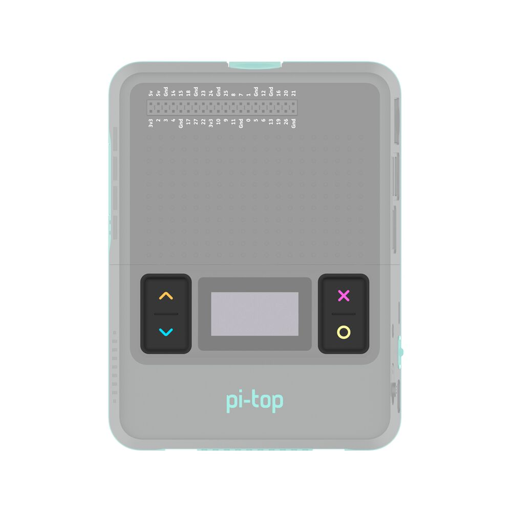

===============================
API - Core pi-top Functionality
===============================

All pi-tops come with some software-controllable onboard hardware. These sections of the API make it easy to access and change the state of your pi-top hardware.

pi-top Battery
==============

This module provides a simple way to check the current onboard pi-top battery state, and handle
state change events.

This module will work with original pi-top, pi-top [3] and pi-top [4]. pi-topCEED has no onboard battery, and so will not work.

.. literalinclude:: ../examples/battery/battery.py

Class Reference: pi-top Battery
-------------------------------

.. autoclass:: pitop.battery.Battery

pi-top Display
==============

This module provides a simple way to check the current onboard pi-top display state, and handle
state change events.

This module will work with original pi-top, pi-topCEED and pi-top [3]. pi-top [4] has no onboard display, and the official pi-top [4] display is not software controllable, and so will not work.

.. literalinclude:: ../examples/display/display.py

Class Reference: pi-top Display
-------------------------------

.. autoclass:: pitop.display.Display

pi-top [4] Miniscreen
=====================

.. image:: _static/miniscreen/pi-top_4_Front.jpg

The Miniscreen of the pi-top [4] can be found on the front, comprised of an 128x64 pixel
OLED screen and 4 programmable buttons.

The `pt-sys-oled` package, provided out-of-the-box with pi-topOS (and available for Raspberry Pi OS),
provides a convenient interactive menu interface, using the OLED for display and buttons for navigation
and actions. This menu includes useful information and options about the system state and configuration.

This module is designed to work with `pt-sys-oled` in a complementary way, but there are some important
things to note - see :ref:`faq-lost-oled-menu`.

Buttons
-------

This module allows you to interact with the buttons on the front of a pi-top [4].
You can write code to respond to these buttons being pressed and released.
The following code example shows two different ways of doing this.

To get started, copy this code into your program and see what you can make using the buttons.

Note: when you write a program that interacts with the pi-top [4] buttons, you will not be able to use them to control the mini-screen system menu.

.. literalinclude:: ../examples/miniscreen/buttons/buttons.py

Class Reference: pi-top [4] Miniscreen Buttons
----------------------------------------------

.. autoclass:: pitop.miniscreen.Buttons
    :exclude-members: UP, DOWN, SELECT, CANCEL, instance
    :inherited-members:

.. autoclass:: pitop.miniscreen.UpButton
    :inherited-members:

.. autoclass:: pitop.miniscreen.DownButton
    :inherited-members:

.. autoclass:: pitop.miniscreen.SelectButton
    :inherited-members:

.. autoclass:: pitop.miniscreen.CancelButton
    :inherited-members:

OLED screen
-----------

.. image:: _static/miniscreen/pi-top_4_Front_OLED.jpg

This module contains information to allow a programmer to work with the mini-screen on the pi-top [4].
Below you will find a list of the different objects that can be created to do this along with their
descriptions, methods and examples of how to do this.

To get started you can copy and paste some of the examples into your own program to try them out. The
**OLED** class has some simple methods to interact with the screen, allowing you to draw text and
simple images. For displaying more advanced things, you may need to investigate the **Canvas** class.

**Note:** When you create a `OLED` object in your program, the mini-screen on the pi-top [4] will
clear and is then controlled by your code. You will not be able to access the system menu on the mini-screen
until your program exits, at which point the system menu is automatically restored. If you need to provide
yourself with a method of being able to exit, it is recommended that you check for a press event on the
'cancel' button:

.. literalinclude:: ../examples/miniscreen/exit_with_cancel_button.py

Whilst this snippet is provided for ease of use, it is strongly recommended that you look at the documentation for the pi-top [4] buttons for detailed instructions of its usage.

Writing text to the OLED
------------------------

.. literalinclude:: ../examples/miniscreen/oled/hello_world.py

Showing an image on the OLED
----------------------------

.. literalinclude:: ../examples/miniscreen/oled/display_an_image.py

Loop a GIF on the OLED
----------------------

.. literalinclude:: ../examples/miniscreen/oled/animated_image_loop.py

Displaying an GIF once
----------------------

.. literalinclude:: ../examples/miniscreen/oled/animated_image_once_simple_way.py

Displaying an GIF once through frame by frame
---------------------------------------------

.. literalinclude:: ../examples/miniscreen/oled/animated_image_once.py

Displaying an GIF looping in background
---------------------------------------

.. literalinclude:: ../examples/miniscreen/oled/animated_image_loop_in_background.py

Handling basic 2D graphics drawing and displaying on the OLED
-------------------------------------------------------------

.. literalinclude:: ../examples/miniscreen/oled/drawing_2d_graphics.py

Displaying a clock on the OLED
------------------------------

.. literalinclude:: ../examples/miniscreen/oled/clock.py

Display a particle-based screensaver in the OLED
------------------------------------------------

.. literalinclude:: ../examples/miniscreen/oled/particles.py

Prim's algorithm
----------------

.. literalinclude:: ../examples/miniscreen/oled/prims_algorithm.py

Class Reference: pi-top [4] Miniscreen OLED Display
---------------------------------------------------

.. autoclass:: pitop.miniscreen.OLED
