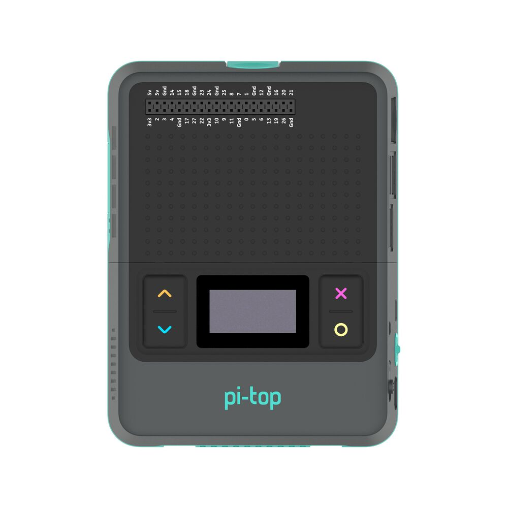

======================================
API - pi-top [4] Miniscreen
======================================

The Miniscreen of the pi-top [4] can be found on the front, comprised of an 128x64 pixel
OLED screen and 4 programmable buttons.

The `pt-sys-oled` package, provided out-of-the-box with pi-topOS (and available for Raspberry Pi OS),
provides a convenient interactive menu interface, using the OLED for display and buttons for navigation
and actions. This menu includes useful information and options about the system state and configuration.

This module is designed to work with `pt-sys-oled` in a complementary way, but there are some important
things to note - see :ref:`faq-lost-oled-menu`.

.. toctree::
    :maxdepth: 2

    miniscreen/oled
    miniscreen/buttons
