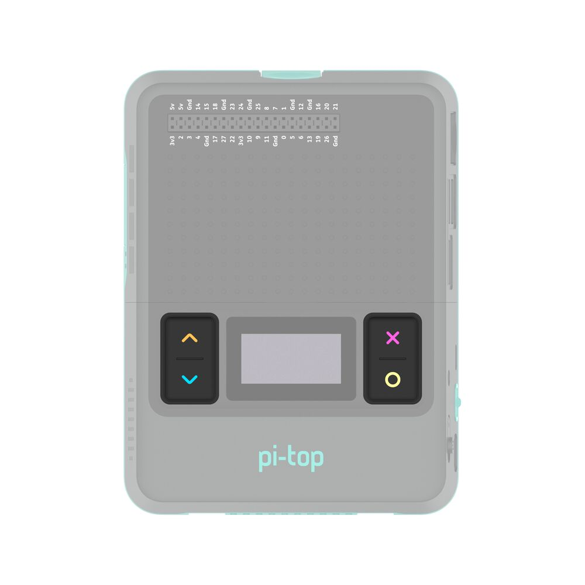

======================================
API - pi-top [4] Mini Screen - Buttons
======================================

This module allows you to interact with the buttons on the front of a pi-top [4].
You can write code to respond to these buttons being pressed and released.
The following code example shows two different ways of doing this.

To get started, copy this code into your program and see what you can make using the buttons.

Note: when you write a program that interacts with the pi-top [4] buttons, you will not be able to use them to control the mini-screen system menu.

.. literalinclude:: ../../examples/miniscreen/buttons/buttons.py

--------
Buttons
--------

.. autoclass:: pitop.miniscreen.Buttons
    :members:
    :exclude-members: UP, DOWN, SELECT, CANCEL, instance
    :show-inheritance:
    :inherited-members:

.. autoclass:: pitop.miniscreen.UpButton
    :members:
    :show-inheritance:
    :inherited-members:

.. autoclass:: pitop.miniscreen.DownButton
    :members:
    :show-inheritance:
    :inherited-members:

.. autoclass:: pitop.miniscreen.SelectButton
    :members:
    :show-inheritance:
    :inherited-members:

.. autoclass:: pitop.miniscreen.CancelButton
    :members:
    :show-inheritance:
    :inherited-members:

.. autoclass:: pitop.miniscreen.buttons.buttons.MiniscreenButton
    :members:
    :show-inheritance:
    :inherited-members:
