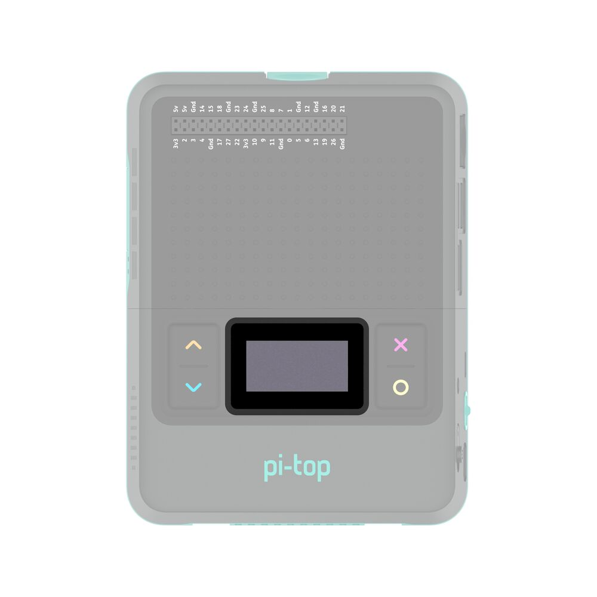

===================================
API - pi-top [4] Mini Screen - OLED
===================================

This module contains information to allow a programmer to work with the mini-screen on the pi-top [4].
Below you will find a list of the different objects that can be created to do this along with their
descriptions, methods and examples of how to do this.

To get started you can copy and paste some of the examples into your own program to try them out. The
**OLED** class has some simple methods to interact with the screen, allowing you to draw text and
simple images. For displaying more advanced things, you may need to investigate the **Canvas** class.

**Note:** When you create a `OLED` object in your program, the mini-screen on the pi-top [4] will
clear and is then controlled by your code. You will not be able to access the system menu on the mini-screen
until your program exits, at which point the system menu is automatically restored. If you need to provide
yourself with a method of being able to exit, it is recommended that you check for a press event on the
'cancel' button:

.. literalinclude:: ../../examples/miniscreen/exit_with_cancel_button.py

Whilst this snippet is provided for ease of use, it is strongly recommended that you look at the documentation for the pi-top [4] buttons for detailed instructions of its usage.

Writing text to the OLED
------------------------------------

.. literalinclude:: ../../examples/miniscreen/oled/hello_world.py

Showing an image on the OLED
----------------------------------------

.. literalinclude:: ../../examples/miniscreen/oled/display_an_image.py

Loop a GIF on the OLED
----------------------------------------

.. literalinclude:: ../../examples/miniscreen/oled/animated_image_loop.py

Displaying an GIF once
----------------------------------------------

.. literalinclude:: ../../examples/miniscreen/oled/animated_image_once_simple_way.py

Displaying an GIF once through frame by frame
-----------------------------------------------------------------------

.. literalinclude:: ../../examples/miniscreen/oled/animated_image_once.py

Displaying an GIF looping in background
------------------------------------------------------------------

.. literalinclude:: ../../examples/miniscreen/oled/animated_image_loop_in_background.py

Drawing shapes and displaying them on the OLED
------------------------------------------------------------------

.. literalinclude:: ../../examples/miniscreen/oled/drawing_with_canvas.py

Displaying a clock on the OLED
------------------------------------------------------------------

.. literalinclude:: ../../examples/miniscreen/oled/clock.py

Display a particle-based screensaver in the OLED
------------------------------------------------------------------

.. literalinclude:: ../../examples/miniscreen/oled/particles.py

Prim's algorithm
------------------------------------------------------------------

.. literalinclude:: ../../examples/miniscreen/oled/prims_algorithm.py

---------------------
OLED class
---------------------

.. autoclass:: pitop.miniscreen.OLED

---------------------
Canvas class
---------------------

.. automodule:: pitop.miniscreen.oled.core.canvas
    :members:
    :undoc-members:
    :show-inheritance:
