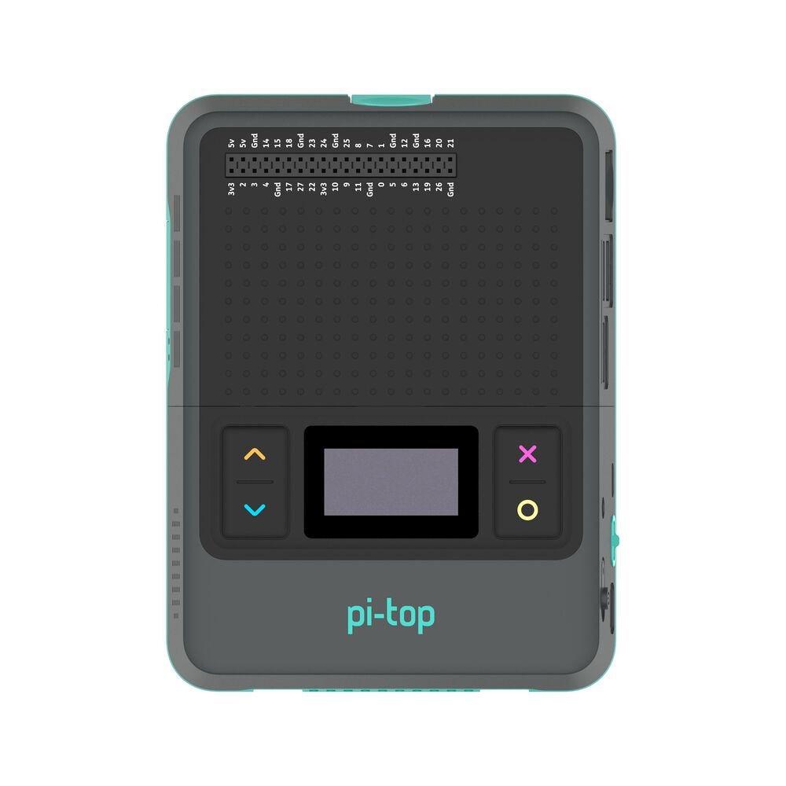

===================
API - pi-top Device
===================

All pi-tops come with some software-controllable onboard hardware. These sections of the API make it easy to access and change the state of your pi-top hardware.

pi-top Battery
==============

This class provides a simple way to check the current onboard pi-top battery state, and handle
some state change events.

This class will work with original pi-top, pi-top [3] and pi-top [4]. pi-topCEED has no onboard battery, and so will not work.

.. literalinclude:: ../examples/battery/battery.py

Class Reference: pi-top Battery
-------------------------------

.. autoclass:: pitop.battery.Battery

pi-top Display
==============

This class provides a simple way to check the current onboard pi-top display state, and handle
state change events.

This class will work with original pi-top, pi-topCEED and pi-top [3]. pi-top [4] has no onboard display, and the official pi-top [4] display is not software controllable, and so will not work.

.. literalinclude:: ../examples/display/display.py

Class Reference: pi-top Display
-------------------------------

.. autoclass:: pitop.display.Display

pi-top [4] Miniscreen
=====================

The Miniscreen of the pi-top [4] can be found on the front, comprised of an 128x64 pixel
OLED screen and 4 programmable buttons.

Check out :ref:`Key Concepts: pi-top [4] Miniscreen<key_concepts:pi-top [4] Miniscreen>` for useful information about how this class works.

Buttons
-------

.. image:: _static/miniscreen/pi-top_4_Front_BUTTONS.jpg

You can write code to respond to these buttons being pressed and released.

The buttons are easily accessed from the :class:`pitop.miniscreen.Miniscreen` object:

.. literalinclude:: ../examples/miniscreen/buttons/buttons.py

Class Reference: pi-top [4] Miniscreen Buttons
~~~~~~~~~~~~~~~~~~~~~~~~~~~~~~~~~~~~~~~~~~~~~~

.. autoclass:: pitop.miniscreen.UpButton
    :inherited-members:

.. autoclass:: pitop.miniscreen.DownButton
    :inherited-members:

.. autoclass:: pitop.miniscreen.SelectButton
    :inherited-members:

.. autoclass:: pitop.miniscreen.CancelButton
    :inherited-members:

OLED Display
------------

.. image:: _static/miniscreen/pi-top_4_Front_OLED.jpg

You can write code to send pixel data to the miniscreen's OLED display.

All of the OLED display functionality is available by using the :class:`pitop.miniscreen.Miniscreen` class directly.

Displaying text
~~~~~~~~~~~~~~~

.. literalinclude:: ../examples/miniscreen/oled/hello_world.py

Showing an image
~~~~~~~~~~~~~~~~

.. literalinclude:: ../examples/miniscreen/oled/display_an_image.py

Loop a GIF
~~~~~~~~~~

.. literalinclude:: ../examples/miniscreen/oled/animated_image_loop.py

Displaying an GIF once
~~~~~~~~~~~~~~~~~~~~~~

.. literalinclude:: ../examples/miniscreen/oled/animated_image_once_simple_way.py

Displaying an GIF once through frame by frame
~~~~~~~~~~~~~~~~~~~~~~~~~~~~~~~~~~~~~~~~~~~~~

.. literalinclude:: ../examples/miniscreen/oled/animated_image_once.py

Displaying an GIF looping in background
~~~~~~~~~~~~~~~~~~~~~~~~~~~~~~~~~~~~~~~

.. literalinclude:: ../examples/miniscreen/oled/animated_image_loop_in_background.py

Handling basic 2D graphics drawing and displaying
~~~~~~~~~~~~~~~~~~~~~~~~~~~~~~~~~~~~~~~~~~~~~~~~~

.. literalinclude:: ../examples/miniscreen/oled/drawing_2d_graphics.py

Displaying a clock
~~~~~~~~~~~~~~~~~~

.. literalinclude:: ../examples/miniscreen/oled/clock.py

Display a particle~based screensaver in the OLED
~~~~~~~~~~~~~~~~~~~~~~~~~~~~~~~~~~~~~~~~~~~~~~~~

.. literalinclude:: ../examples/miniscreen/oled/particles.py

Prim's algorithm
~~~~~~~~~~~~~~~~

.. literalinclude:: ../examples/miniscreen/oled/prims_algorithm.py

Class Reference: pi-top [4] Miniscreen
--------------------------------------

.. autoclass:: pitop.miniscreen.Miniscreen
    :inherited-members:
