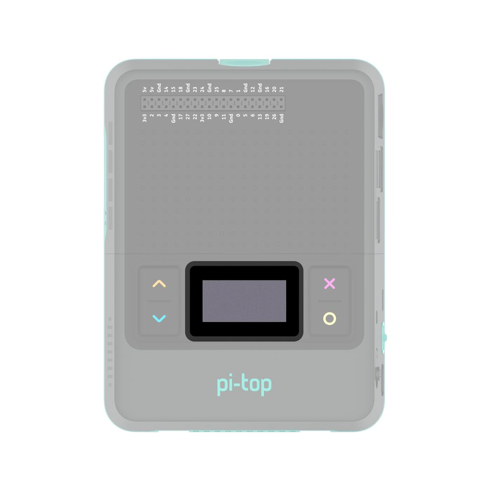

===================
API - pi-top Device
===================

Pitop
=====

This class represents a pi-top device.
Each of the on-board features of pi-tops can be accessed from this object.

.. note::
   This class has been built with pi-top [4] in mind, as is in early development.
   You may notice that some features do not behave as expected on other platforms.

   If you would like to help us with development, please refer to the `Contributing`_
   document in this repository for information!

.. _Contributing: https://github.com/pi-top/pi-top-Python-SDK/blob/master/.github/CONTRIBUTING.md

Here is some sample code demonstrating how the various subsystems of a pi-top [4] can be accessed and used:

.. literalinclude:: ../examples/system/pitop_overview.py

Although it is possible to access pi-top subsystems individually, it is recommended to access them via this class.

Class Reference: Pitop
----------------------

.. autoclass:: pitop.Pitop
    :exclude-members: instance
    :members:

All pi-tops come with some software-controllable onboard hardware. These sections of the API make it easy to access and change the state of your pi-top hardware.

pi-top Battery
==============

This class provides a simple way to check the current onboard pi-top battery state, and handle
some state change events.

This class will work with original pi-top, pi-top [3] and pi-top [4]. pi-topCEED has no onboard battery, and so will not work.

.. literalinclude:: ../examples/system/battery.py

Class Reference: pi-top Battery
-------------------------------

.. autoclass:: pitop.battery.Battery

pi-top Display
==============

This class provides a simple way to check the current onboard pi-top display state, and handle
state change events.

This class will work with original pi-top, pi-topCEED and pi-top [3].

..note::
  Not compatible with pi-top [4].

  pi-top [4] has no onboard display, and the official pi-top [4] FHD Display is not software-controllable.

.. literalinclude:: ../examples/system/display.py

Class Reference: pi-top Display
-------------------------------

.. autoclass:: pitop.display.Display

pi-top [4] Miniscreen
=====================

.. image:: _static/miniscreen/pi-top_4_Front.jpg

The miniscreen of the pi-top [4] can be found on the front, comprised of an 128x64 pixel
OLED screen and 4 programmable buttons.

Check out :ref:`Key Concepts: pi-top [4] Miniscreen<key_concepts:pi-top [4] Miniscreen>` for useful information about how this class works.

Using the Miniscreen's OLED Display
-----------------------------------

The OLED display is an array of pixels that can be either on or off. Unlike the pixels in a more advanced display, such as the monitor you are most likely reading this on, the display is a "1-bit monochromatic" display. Text and images can be displayed by directly manipulating the pixels.

The :class:`pitop.miniscreen.Miniscreen` class directly provides display functions for the OLED.

Displaying text
~~~~~~~~~~~~~~~

.. literalinclude:: ../examples/system/miniscreen/miniscreen_display_hello_world.py

Showing an image
~~~~~~~~~~~~~~~~

.. literalinclude:: ../examples/system/miniscreen/miniscreen_display_image_file.py

Loop a GIF
~~~~~~~~~~

.. literalinclude:: ../examples/system/miniscreen/miniscreen_display_animated_image_loop.py

Displaying an GIF once
~~~~~~~~~~~~~~~~~~~~~~

.. literalinclude:: ../examples/system/miniscreen/miniscreen_display_animated_image_once_simple_way.py

Displaying an GIF once through frame by frame
~~~~~~~~~~~~~~~~~~~~~~~~~~~~~~~~~~~~~~~~~~~~~

.. literalinclude:: ../examples/system/miniscreen/miniscreen_display_animated_image_once.py

Displaying an GIF looping in background
~~~~~~~~~~~~~~~~~~~~~~~~~~~~~~~~~~~~~~~

.. literalinclude:: ../examples/system/miniscreen/miniscreen_display_animated_image_loop_in_background.py

Handling basic 2D graphics drawing and displaying
~~~~~~~~~~~~~~~~~~~~~~~~~~~~~~~~~~~~~~~~~~~~~~~~~

.. literalinclude:: ../examples/system/miniscreen/miniscreen_display_2d_graphics.py

Displaying a clock
~~~~~~~~~~~~~~~~~~

.. literalinclude:: ../examples/system/miniscreen/miniscreen_display_clock.py

Display a particle-based screensaver
~~~~~~~~~~~~~~~~~~~~~~~~~~~~~~~~~~~~

.. literalinclude:: ../examples/system/miniscreen/miniscreen_display_particles.py

Prim's algorithm
~~~~~~~~~~~~~~~~

.. literalinclude:: ../examples/system/miniscreen/miniscreen_display_prims_algorithm.py

2-Player Pong Game
~~~~~~~~~~~~~~~~~~

.. literalinclude:: ../examples/system/miniscreen/miniscreen_play_pong_game.py

Class Reference: pi-top [4] Miniscreen
--------------------------------------

.. autoclass:: pitop.miniscreen.Miniscreen
    :inherited-members:

Using the Miniscreen's Buttons
------------------------------

.. image:: _static/miniscreen/pi-top_4_Front_BUTTONS.jpg

The miniscreen's buttons are simple, and behave in a similar way to the other button-style components in this SDK. Each miniscreen button can be queried for their "is pressed" state, and also invoke callback functions for when pressed and released.

The :class:`pitop.miniscreen.Miniscreen` class provides these buttons as properties:

    >>> from pitop import Pitop
    >>> pitop = Pitop()
    >>> miniscreen = pitop.miniscreen
    >>> miniscreen.up_button
    <pitop.miniscreen.miniscreen.MiniscreenButton object at 0xb3e44e50>
    >>> miniscreen.down_button
    <pitop.miniscreen.miniscreen.MiniscreenButton object at 0xb3e44d30>
    >>> miniscreen.select_button
    <pitop.miniscreen.miniscreen.MiniscreenButton object at 0xb3e44e90>
    >>> miniscreen.cancel_button
    <pitop.miniscreen.miniscreen.MiniscreenButton object at 0xb3e44e70>

Here is an example demonstrating 2 ways to make use of these buttons:

.. literalinclude:: ../examples/system/miniscreen/miniscreen_buttons.py

Class Reference: pi-top [4] Miniscreen Button
---------------------------------------------

.. autoclass:: pitop.miniscreen.MiniscreenButton
