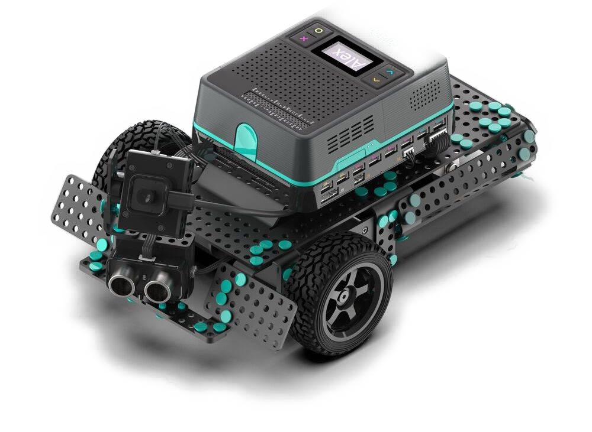

======================================
API - pi-top Makers Architecture (PMA)
======================================

.. image:: _static/pma/foundation_kit/components_spread.jpg

The Foundation & Expansion Plates and all the parts included in the Foundation & Robotics Kit are known as the pi-top Makers Architecture (PMA). This module is designed to interact with each one of these components.

The component interfaces have been provided for simple use of everyday components, and are intended for general use with the devices they represent.

See :ref:`getting_started_pma:Getting Started with pi-top Maker Architecture` for useful information to get started with using PMA.

For even more information about pi-top Makers Architecture, check out the pi-top `Knowledge Base <https://knowledgebase.pi-top.com/knowledge/pma>`_

.. toctree::
    :maxdepth: 3

    api_pma/components
    api_pma/parameters
