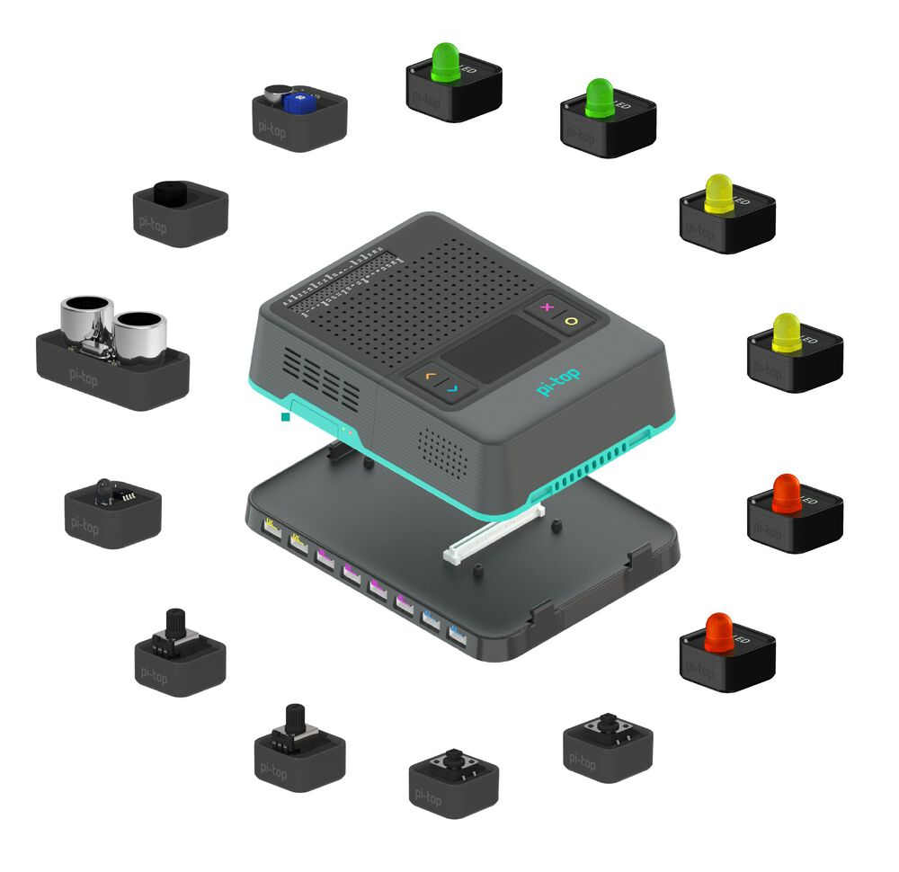

======================================
API - pi-top Maker Architecture (PMA)
======================================

.. image:: _static/pma/robotics_kit/Alex.jpg

The Foundation & Expansion Plates and all the parts included in the Foundation & Robotics Kit are known as the pi-top Maker Architecture (PMA). This module is designed to interact with each one of these components.

The component interfaces have been provided for simple use of everyday components, and are intended for general use with the devices they represent.

See :ref:`getting_started_pma:Getting Started with pi-top Maker Architecture` for useful information to get started with using PMA.

For even more information about pi-top Maker Architecture, check out the pi-top `Knowledge Base <https://knowledgebase.pi-top.com/knowledge/pma>`_

Components
==========

.. _component-button:

Button
-------------------------------

.. note::
   This is a :ref:`Digital Component<digital-component>` which connects to a :ref:`Digital Port<digital-port>` `[D0-D7]`.

.. literalinclude:: ../examples/pma/button.py

.. autoclass:: pitop.pma.Button
   :inherited-members: gpiozero.Button
   :exclude-members: pin_factory

.. _component-buzzer:

Buzzer
-------------------------------

.. image:: _static/pma/foundation_kit/components/buzzer.jpg

.. note::
   This is a :ref:`Digital Component<digital-component>` which connects to a :ref:`Digital Port<digital-port>` `[D0-D7]`.

.. literalinclude:: ../examples/pma/buzzer.py

.. autoclass:: pitop.pma.Buzzer
   :inherited-members: gpiozero.Buzzer
   :exclude-members: pin_factory

.. _component-encoder-motor:

Encoder Motor
-------------------------------

.. note::
   This is a :ref:`Motor Component<motor-component>` which connects to a :ref:`MotorEncoder Port<motor-port>` `[M0-M3]`.

.. literalinclude:: ../examples/pma/encoder_motor.py

.. autoclass:: pitop.pma.EncoderMotor
    :exclude-members: MMK_STANDARD_GEAR_RATIO, MAX_DC_MOTOR_RPM

.. _component-led:

LED
-------------------------------

.. image:: _static/pma/foundation_kit/components/led_red.jpg

.. note::
   This is a :ref:`Digital Component<digital-component>` which connects to a :ref:`Digital Port<digital-port>` `[D0-D7]`.

.. literalinclude:: ../examples/pma/led.py

.. autoclass:: pitop.pma.LED
   :inherited-members: gpiozero.LED
   :exclude-members: pin_factory

.. _component-light-sensor:

Light Sensor
-------------------------------

.. image:: _static/pma/foundation_kit/components/light_sensor.jpg

.. note::
   This is a :ref:`Analog Component<analog-component>` which connects to a :ref:`Analog Port<analog-port>` `[A0-A3]`.

.. literalinclude:: ../examples/pma/light_sensor.py

.. autoclass:: pitop.pma.LightSensor

.. _component-potentiometer:

Potentiometer
-------------------------------

.. image:: _static/pma/foundation_kit/components/potentiometer.jpg

.. note::
   This is a :ref:`Analog Component<analog-component>` which connects to a :ref:`Analog Port<analog-port>` `[A0-A3]`.

.. literalinclude:: ../examples/pma/potentiometer.py

.. autoclass:: pitop.pma.Potentiometer

.. _component-servo-motor:

Servo Motor
-------------------------------

.. note::
   This is a :ref:`Motor Component<motor-component>` which connects to a :ref:`ServoMotor Port<servomotor-port>` `[S0-S3]`.

.. literalinclude:: ../examples/pma/servo_motor.py

.. autoclass:: pitop.pma.ServoMotor
    :exclude-members: ANGLE_RANGE, SPEED_RANGE, MIN_PULSE_WIDTH_MICRO_S, MAX_PULSE_WIDTH_MICRO_S, REGISTER_MIN_PULSE_WIDTH, REGISTER_MAX_PULSE_WIDTH, REGISTER_PWM_FREQUENCY, PWM_FREQUENCY, PWM_PERIOD, DUTY_REGISTER_RANGE, SERVO_LOWER_DUTY, SERVO_UPPER_DUTY, RegisterTypes

.. _component-sound-sensor:

Sound Sensor
-------------------------------

.. image:: _static/pma/foundation_kit/components/sound_sensor.jpg

.. note::
   This is a :ref:`Analog Component<analog-component>` which connects to a :ref:`Analog Port<analog-port>` `[A0-A3]`.

.. literalinclude:: ../examples/pma/sound_sensor.py

.. autoclass:: pitop.pma.SoundSensor

.. _component-ultrasonic-sensor:

Ultrasonic Sensor
-------------------------------

.. note::
   This is a :ref:`Digital Component<digital-component>` which connects to a :ref:`Digital Port<digital-port>` `[D0-D7]`.

.. literalinclude:: ../examples/pma/ultrasonic_sensor.py

.. autoclass:: pitop.pma.UltrasonicSensor
    :exclude-members: ECHO_LOCK

Parameters
==========

Class Reference: Motor Parameters
---------------------------------

.. autoclass:: pitop.pma.parameters.BrakingType

.. autoclass:: pitop.pma.parameters.ForwardDirection

.. autoclass:: pitop.pma.parameters.Direction
