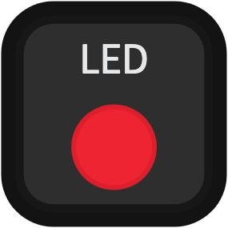
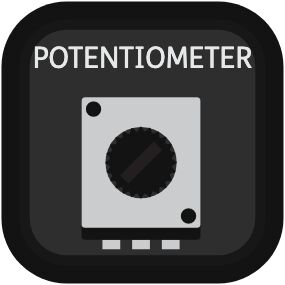

Button
-------------------------------

.. image:: ../_static/pma/foundation_kit/components/button.jpg

.. autoclass:: pitop.pma.Button
   :inherited-members: gpiozero.Button
   :exclude-members: pin_factory

Buzzer
-------------------------------

.. image:: ../_static/pma/foundation_kit/components/buzzer.jpg

.. autoclass:: pitop.pma.Buzzer
   :inherited-members: gpiozero.Buzzer
   :exclude-members: pin_factory

EncoderMotor
-------------------------------

.. autoclass:: pitop.pma.EncoderMotor
    :exclude-members: MMK_STANDARD_GEAR_RATIO, MAX_DC_MOTOR_RPM

LED
-------------------------------

.. autoclass:: pitop.pma.LED
   :inherited-members: gpiozero.LED
   :exclude-members: pin_factory

LightSensor
-------------------------------

.. image:: ../_static/pma/foundation_kit/components/light_sensor.jpg

.. autoclass:: pitop.pma.LightSensor

Potentiometer
-------------------------------

.. autoclass:: pitop.pma.Potentiometer

ServoMotor
-------------------------------

.. autoclass:: pitop.pma.ServoMotor
    :exclude-members: ANGLE_RANGE, SPEED_RANGE, MIN_PULSE_WIDTH_MICRO_S, MAX_PULSE_WIDTH_MICRO_S, REGISTER_MIN_PULSE_WIDTH, REGISTER_MAX_PULSE_WIDTH, REGISTER_PWM_FREQUENCY, PWM_FREQUENCY, PWM_PERIOD, DUTY_REGISTER_RANGE, SERVO_LOWER_DUTY, SERVO_UPPER_DUTY, RegisterTypes

SoundSensor
-------------------------------

.. image:: ../_static/pma/foundation_kit/components/sound_sensor.jpg

.. autoclass:: pitop.pma.SoundSensor

UltrasonicSensor
-------------------------------

.. image:: ../_static/pma/foundation_kit/components/ultrasonic_sensor.jpg

.. autoclass:: pitop.pma.UltrasonicSensor
    :exclude-members: ECHO_LOCK
