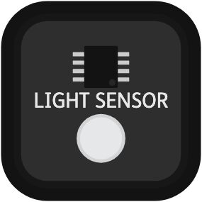
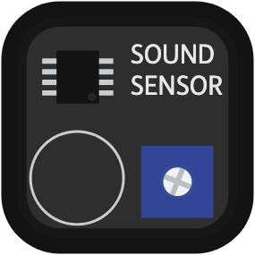

.. _component-button:

Button
-------------------------------

.. image:: ../_static/pma/foundation_kit/components/button.jpg

.. note::
   This is a :ref:`Digital Component<digital-component>` which connects to a :ref:`Digital Port<digital-port>` `[D0-D7]`.

.. autoclass:: pitop.pma.Button
   :inherited-members: gpiozero.Button
   :exclude-members: pin_factory

.. _component-buzzer:

Buzzer
-------------------------------

.. note::
   This is a :ref:`Digital Component<digital-component>` which connects to a :ref:`Digital Port<digital-port>` `[D0-D7]`.

.. autoclass:: pitop.pma.Buzzer
   :inherited-members: gpiozero.Buzzer
   :exclude-members: pin_factory

.. _component-motorencoder:

MotorEncoder
-------------------------------

.. note::
   This is a :ref:`Motor Component<motor-component>` which connects to a :ref:`MotorEncoder Port<motor-port>` `[M0-M3]`.

.. autoclass:: pitop.pma.EncoderMotor
    :exclude-members: MMK_STANDARD_GEAR_RATIO, MAX_DC_MOTOR_RPM

.. _component-led:

LED
-------------------------------

.. image:: ../_static/pma/foundation_kit/components/led_red.jpg

.. note::
   This is a :ref:`Digital Component<digital-component>` which connects to a :ref:`Digital Port<digital-port>` `[D0-D7]`.

.. autoclass:: pitop.pma.LED
   :inherited-members: gpiozero.LED
   :exclude-members: pin_factory

.. _component-lightsensor:

LightSensor
-------------------------------

.. note::
   This is a :ref:`Analog Component<analog-component>` which connects to a :ref:`Analog Port<analog-port>` `[A0-A3]`.

.. autoclass:: pitop.pma.LightSensor

.. _component-potentiometer:

Potentiometer
-------------------------------

.. image:: ../_static/pma/foundation_kit/components/potentiometer.jpg

.. note::
   This is a :ref:`Analog Component<analog-component>` which connects to a :ref:`Analog Port<analog-port>` `[A0-A3]`.

.. autoclass:: pitop.pma.Potentiometer

.. _component-servomotor:

ServoMotor
-------------------------------

.. note::
   This is a :ref:`Motor Component<motor-component>` which connects to a :ref:`ServoMotor Port<servomotor-port>` `[S0-S3]`.

.. autoclass:: pitop.pma.ServoMotor
    :exclude-members: ANGLE_RANGE, SPEED_RANGE, MIN_PULSE_WIDTH_MICRO_S, MAX_PULSE_WIDTH_MICRO_S, REGISTER_MIN_PULSE_WIDTH, REGISTER_MAX_PULSE_WIDTH, REGISTER_PWM_FREQUENCY, PWM_FREQUENCY, PWM_PERIOD, DUTY_REGISTER_RANGE, SERVO_LOWER_DUTY, SERVO_UPPER_DUTY, RegisterTypes

.. _component-soundsensor:

SoundSensor
-------------------------------

.. note::
   This is a :ref:`Analog Component<analog-component>` which connects to a :ref:`Analog Port<analog-port>` `[A0-A3]`.

.. autoclass:: pitop.pma.SoundSensor

.. _component-ultrasonic:

UltrasonicSensor
-------------------------------

.. image:: ../_static/pma/foundation_kit/components/ultrasonic_sensor.jpg

.. note::
   This is a :ref:`Analog Component<analog-component>` which connects to a :ref:`Analog Port<analog-port>` `[A0-A3]`.

.. autoclass:: pitop.pma.UltrasonicSensor
    :exclude-members: ECHO_LOCK
