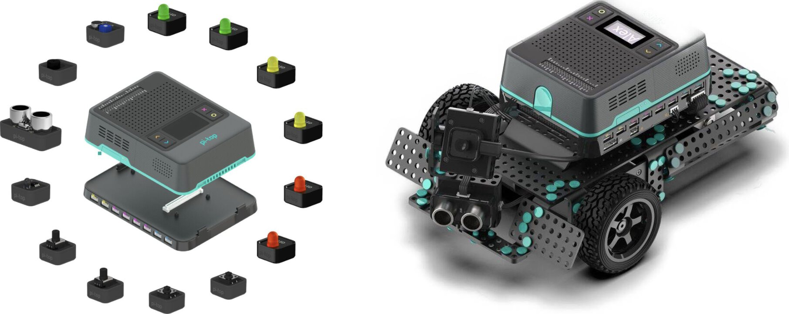

===========================
pi-top Python SDK (Preview)
===========================

A simple, modular interface for interacting with a pi-top and its related accessories and components.

Supports all pi-top devices:

.. image:: _static/overview/devices.jpg

Supports pi-top Maker Architecture (PMA):

Supports all pi-top peripherals:

.. image:: _static/overview/peripherals.jpg

--------------------------
Status: Active Development
--------------------------

This SDK is currently in active development. Please be patient while we work towards v1.0.0!

Backwards Compatibility
=======================

When this library reaches v1.0.0, we will aim to maintain backwards-compatibility thereafter.
Until then, every effort will be made to ensure stable support, but it cannot be guaranteed.
Breaking changes will be clearly documented.

-----
About
-----

This SDK aims to provide an easy-to-use framework for managing a pi-top.
It includes a Python 3 package (`pitop`), with several custom modules and classes for interfacing
with a range of pi-top devices and peripherals. It also contains CLI utilities, to interact with
your pi-top using the terminal.

The SDK is included out-of-the-box with pi-topOS.

Ensure that you keep your system up-to-date to enjoy the latest features and bug fixes.

This library is installed as a Python 3 module called `pitop`. It includes several
submodules that allow you to easily interact with most of the hardware inside a pi-top.

You can easily connect different components of the system using the
modules available in the library:

.. code-block:: python

    from time import sleep
    from pitop.pma import UltrasonicSensor
    from pitop.miniscreen import Miniscreen

    miniscreen = Miniscreen()
    utrasonic = PMAUltrasonicSensor("D1")

    while True:
        miniscreen.display_multiline_text(utrasonic.distance)
        sleep(0.1)

Check out the :ref:`overview:Overview` chapter for more information on what you can do.

The SDK also contains a Command Line Interface (CLI).
See the :ref:`'pi-top' command<cli_tools:'pi-top' Command>` for more information.

-----------------
Table of Contents
-----------------

.. toctree::
    :maxdepth: 2
    :numbered:

    getting_started
    overview
    key_concepts
    recipes_api
    api_pitop_device
    api_pma_components
    api_pitop_peripheral_devices
    api_system_devices
    cli_tools
    more
