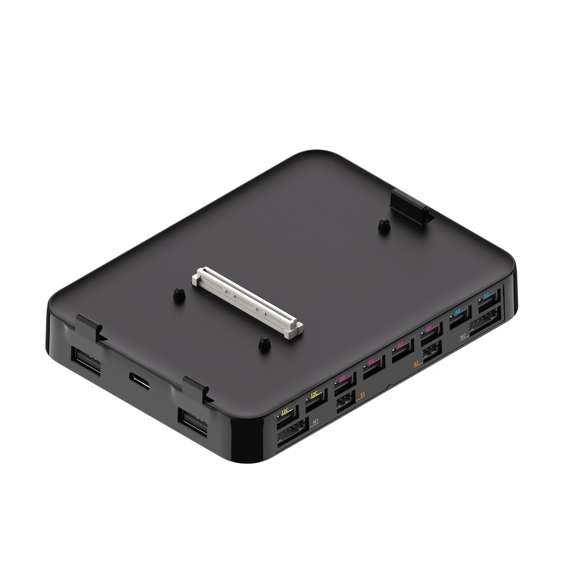

============
Key Concepts
============

pi-top Maker Architecture
=========================

This section aims to clarify the various components of PMA, and the terminology that is required to get the most out of it.

Inputs and Outputs
------------------

A component can be classified as an Input or Output, according to how it behaves.

An Input component generates electric signals that can be interpreted as information when read. For example, when a button is clicked,
the electric signal it produces lets you know that it's state changed.

An Output component receives electric signals and performs an action based on them. For example, a buzzer;
when no signal is applied it will be silent; however when an electric signal is applied, it will
generate sound.

Digital and Analog
------------------

Components can also be classified according to the type of electric signals they use.

Digital components only use digital electric signals; digital signals are discrete and carry information in binary form, most of the times consisting in different voltage values.
This change in voltage can be read by a Raspberry Pi directly.

Analog components use analog electric signals; analog signals are continuous and can have infinite values in a determined range.
Raspberry Pi can't directly read these signals since it's a digital component. To be able to manage analog signals, the Foundation and Expansion plates include
an Analog to Digital Converter (ADC). This device converts the analog signal from the component into a digital signal that can be interpreted by the Raspberry Pi.

Ports and Pins
--------------

The pi-top Maker Architecture (PMA) connector on the pi-top [4] makes available all GPIO from the Raspberry Pi to the Foundation and Expansion Plates.

This means that the ports located in these plates are mapped to the GPIO header on the Raspberry Pi, providing easy and standard access through Grove connectors
to these pins.

Foundation and Expansion Plates have multiple connectors that can be used to interface with different kind components.

.. _digital-port:

Digital Ports
~~~~~~~~~~~~~

Used to communicate with digital devices.

These ports are labeled from `D0` to `D7`.

.. _analog-port:

Analog Ports
~~~~~~~~~~~~

Used to communicate with analog devices.

These ports are labeled from `A0` to `A3`.

.. _motor-port:

Motor Ports
~~~~~~~~~~~

Communicates a motor encoder component with the motor controller, located inside the Expansion Plate.

These ports are labeled from `M0` to `M3`

.. _servomotor-port:

ServoMotor Ports
~~~~~~~~~~~~~~~~

Communicates a servo motor component with the servomotor controller, located inside the Expansion Plate.

These ports are labeled from `S0` to `S3`.

.. _i2c-port:

I2C Ports
~~~~~~~~~

Used to communicate with generic I2C devices.

These ports are labeled as `I2C`.

Identifying PMA port for a component
------------------------------------

The components included in the Foundation Kit & Robotics Kit can be classified according to how they operate and communicate.

.. _digital-component:

Digital component
~~~~~~~~~~~~~~~~~

These components should be connected to a :ref:`Digital Port<digital-port>` on the Foundation/Expansion Plates.

The Digital components included in the Foundation & Robotics Kits are:

- :ref:`Button<component-button>`
- :ref:`Buzzer<component-buzzer>`
- :ref:`LED<component-led>`

.. _analog-component:

Analog component
~~~~~~~~~~~~~~~~

These components should be connected to a :ref:`Analog Port<analog-port>` on the Foundation/Expansion Plates, labeled from `A0` to `A3`.

The Analog components included in the Foundation & Robotics Kits are:

- :ref:`LightSensor<component-light-sensor>`
- :ref:`Potentiometer<component-potentiometer>`
- :ref:`SoundSensor<component-sound-sensor>`
- :ref:`UltrasonicSensor<component-ultrasonic-sensor>`

.. _motor-component:

Motor component
~~~~~~~~~~~~~~~

An electromechanical component that is controlled by communicating with a microprocessor located inside the Expansion Plate.

These components should be connected to a :ref:`Motor Port<motor-port>` or to :ref:`ServoMotor Port<servomotor-port>` on the Expansion Plate,
depending on the component used.

The `Motor` component included in the Robotics Kits are:

- :ref:`MotorEncoder<component-encoder-motor>` (connects to a :ref:`Motor Port<motor-port>`)
- :ref:`ServoMotor<component-servo-motor>` (connects to a :ref:`ServoMotor Port<servomotor-port>`)

More Information
----------------
For more information about pi-top Maker Architecture, check out the pi-top `Knowledge Base <https://knowledgebase.pi-top.com/knowledge/pma>`_.

pi-top [4] Miniscreen
=====================

.. image:: _static/miniscreen/pi-top_4_Front.jpg

The miniscreen of the pi-top [4] can be found on the front, comprised of an 128x64 pixel
OLED screen and 4 programmable buttons.

The `pt-sys-oled` package, provided out-of-the-box with pi-topOS (and available for Raspberry Pi OS),
provides a convenient interactive menu interface, using the pi-top [4]'s miniscreen OLED display and
buttons for navigation and actions. This menu includes useful information and options about the system
state and configuration.

When a user program creates an instance of the miniscreen, the system menu will clear itself and
start to ignore button press events until the user program exits. This is true, regardless of
whether or not the OLED display or the buttons were intended to be used.

.. warning::
   When you write a program that interacts with the pi-top [4] miniscreen, the miniscreen display
   will clear itself, ready to be controlled by user code.

   The system menu cannot be accessed until the program exits, at which point the system menu is
   automatically restored.

.. note::
   For convenience, it is recommended that you provide yourself with an easy method of being able
   to exit your program. It is recommended that you configure an input (such as the miniscreen's
   'cancel' button) to trigger an exit. This is particularly helpful if you wish to start/stop
   your project headlessly (that is, without requiring a display or keyboard/mouse).

   Here is one way of achieving this:

   .. literalinclude:: ../examples/system/miniscreen/miniscreen_exit_cancel_button.py

If you wish to make use of any of the functionality in system menu, have a go at implementing
it yourself in your own project!
