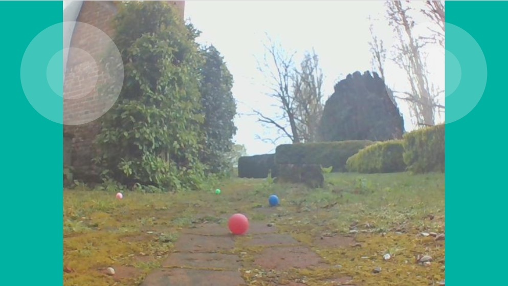

===============================
Labs - Experimental APIs
===============================

The pi-top Python SDK Labs are a set of classes which are being provided as
experiments in exciting new ways to interact with your device. Everything in
Labs is subject to change so use at your own risk.

Web
====

The Web Labs have been created with the goal of giving users the power to create
websites that run on the pi-top, and so can control the pi-top remotely. To
achieve this we have added a number of classes which each serve a different
purpose:

- WebServer for simple websites
- WebController for building websites that interact with your pi-top
- RoverWebController for controlling rover projects
- Prebuilt blueprints for quickly adding features to your custom WebServers

WebServer
==========

The WebServer class is used to create a zero config server that can:

* serve static files and templates
* handle requests
* handle WebSocket connections

WebServer is a preconfigured gevent `WSGIServer`_, due to this it can be started and
stopped just like a gevent `BaseServer`_:

.. code-block:: python

    from pitop.labs import WebServer

    server = WebServer()

    # start server in the background
    server.start()

    # stop server that has been started in the background
    server.stop()

    # start server and wait until interrupted
    server.serve_forever()

WebServer serves static files and templates found in the working directory
automatically. The entrypoint file is always :code:`index.html`. All html files
found are considered to be `Jinja templates`_, this means that if you have a
file :code:`layout.html` in the same directory as your WebServer:

.. code-block:: jinja

    <html>
      <head>
          <title>My Website</title>
      </head>
      <body>
        
        
      </body>
    </html>

It is possible to use it as template for other html files. For example
:code:`index.html` can extend :code:`layout.html`:

.. code-block:: jinja

    

    
      <h1>My Custom Body</h1>
    

To add routes you can use the underlying `Flask`_ app's `route decorator`_:

.. code-block:: python

    from pitop.labs import WebServer

    server = WebServer()

    @server.app.route('/ping')
    def ping():
        return 'pong'

    server.serve_forever()

WebSocket routes can be added by using the route decorator provided by
`Flask Sockets`_:

.. code-block:: python

    from pitop.labs import WebServer

    server = WebServer()

    @server.sockets.route('/ws')
    def ws(socket):
        while not socket.closed:
            message = socket.receive()
            socket.send(message)

    server.serve_forever()

The server :code:`port` defaults to 8070 but can be customised:

.. code-block:: python

    from pitop.labs import WebServer

    server = WebServer(port=8071)

It is also possible to customise the `Flask`_ app by passing your own into the
:code:`app` keyword argument:

.. code-block:: python

    from pitop.labs import WebServer
    from flask import Flask

    server = WebServer(app=Flask(__name__))

WebServer is fully compatible with Flask `blueprints`_, which can be passed to
the :code:`blueprints` keyword argument:

.. code-block:: python

    from pitop.labs import WebServer
    from flask import Blueprint

    WebServer(blueprints=[
        Blueprint('custom', __name__)
    ])

We provide a number of premade blueprints:

* :ref:`labs:BaseBlueprint`
* :ref:`labs:WebComponentsBlueprint`
* :ref:`labs:MessagingBlueprint`
* :ref:`labs:VideoBlueprint`

By default WebServer uses the :ref:`labs:BaseBlueprint`

WebController
==============

The WebController class is subclass of :ref:`labs:WebServer` that uses the
:ref:`labs:ControllerBlueprint`. It exists as a convenience class so blueprints
are not required to build simple web controllers:

.. code-block:: python

    from pitop import Camera
    from pitop.labs import WebController

    camera = Camera()

    def on_dinner_change(data):
        print(f'dinner is now {data}')

    server = WebController(
      get_frame=camera.get_frame,
      message_handlers={'dinner_changed': on_dinner_change}
    )

    server.serve_forever()

See the :ref:`labs:ControllerBlueprint` reference for more detail.

RoverWebController
==================

The RoverWebController class is subclass of :ref:`labs:WebServer` that uses the
:ref:`labs:RoverControllerBlueprint`. It exists as a convenience class so
blueprints are not required to build simple rover web controllers:

.. code-block:: python

    from pitop import Pitop, Camera, DriveController, PanTiltController
    from pitop.labs import RoverWebController

    rover = Pitop()
    rover.add_component(Camera())
    rover.add_component(DriveController())
    rover.add_component(PanTiltController())

    server = RoverWebController(
      get_frame=rover.camera.get_frame,
      drive=rover.drive,
      pan_tilt=rover.pan_tilt
    )

    server.serve_forever()

See the :ref:`labs:RoverControllerBlueprint` reference for more detail.

BaseBlueprint
===============

BaseBlueprint provides a layout and styles that are the base of the
templates found in other blueprints. It adds a :code:`base.html` template which
has the following structure:

.. literalinclude:: ../pitop/labs/web/blueprints/base/templates/base.html
    :language: jinja

The :code:`base.html` adds some basic styles and variables to the page by
linking the :code:`index.css` static file.

.. literalinclude:: ../pitop/labs/web/blueprints/base/base/index.css

Adding the BaseBlueprint to a WebServer is done as follows:

.. code-block:: python

    from pitop.labs import WebServer, BaseBlueprint

    server = WebServer(blueprints=[
        BaseBlueprint()
    ])

    server.serve_forever()

Note: WebServer uses BaseBlueprint by default, so the above is only necessary if
you are using BaseBlueprint with other blueprints.

Then you are able to extend the :code:`base.html` in your other html files:

.. code-block:: jinja

    

    Custom Page

    
      <!-- call super() to add index.css -->
      {{ super() }}
      <link rel="styles" href="custom-styles.css"></link>
    

    
      </img>
    

    
      <section>Section One</section>
      <section>Section Two</section>
    

    
      Contact Info: 123456789
    

If you want to use the static files provided without extending the
:code:`base.html` template you can do so by adding them to the page yourself:

.. code-block:: html

    <html>
      <head>
        <link rel="stylesheet" href="/base/index.css"></link>
      </head>
      <body>
      </body>
    </html>

WebComponentsBlueprint
=======================

WebComponentsBlueprint provides a set of `Web Components`_ for adding complex
elements to the page.

Adding the WebComponentsBlueprint to a WebServer is done as follows:

.. code-block:: python

    from pitop.labs import WebServer, WebComponentsBlueprint

    server = WebServer(blueprints=[
        WebComponentsBlueprint()
    ])

    server.serve_forever()

To add the components to the page WebComponentsBlueprint provides a setup template
:code:`setup-components.html` that can be included in the :code:`head` of your
page

.. code-block:: jinja

    <head>
      
    </head>

Currently the only component included is the :code:`joystick-component`, which
acts a wrapper around `nippleJS`_.

.. code-block:: html

    <joystick-component
      mode="static"
      size="200"
      position="relative"
      positionTop="100"
      positionLeft="100"
      positionRight=""
      positionBottom=""
      onmove="console.log(data)"
      onend="console.log(data)"
    ></joystick-component>

To add the joystick-component to the page without using templates you can add it
to the page by adding the :code:`nipplejs.min.js` and
:code:`joystick-component.js` scripts to the :code:`head` of your page:

.. code-block:: html

    <head>
      
      
    </head>

MessagingBlueprint
===================

MessagingBlueprint is used to communicate between your python code and the page.

Adding the MessagingBlueprint to a WebServer is done as follows:

.. code-block:: python

    from pitop.labs import WebServer, MessagingBlueprint

    server = WebServer(blueprints=[
        MessagingBlueprint()
    ])

    server.serve_forever()

To add messaging to the page MessagingBlueprint provides a setup template
:code:`setup-messaging.html` that can be included in the :code:`head` of your
page:

.. code-block:: jinja

    <head>
      
    </head>

This adds a `JavaScript`_ function :code:`publish` to the page, which you can use
to send `JavaScript Objects`_ to your WebServer. The messages must have a :code:`type`,
and can optionally have some :code:`data`.

.. code-block:: html

    <select
      id="dinner-select"
      onchange="publish({ type: 'dinner_changed', data: this.value })"
    >
      <option value="tacos">Tacos</option>
      <option value="spaghetti">Spaghetti</option>
    </select>

To receive the messages sent by :code:`publish` you can pass a
:code:`message_handlers` dictionary to MessagingBlueprint. The keys of
:code:`message_handlers` correspond to the :code:`type` of the message and the
value must be a function that handles the message, a 'message handler'. The
message handler is passed the message's :code:`data` value as it's first
argument.

.. code-block:: python

    from pitop.labs import WebServer, MessagingBlueprint

    def on_dinner_change(data):
        print(f'dinner is now {data}')

    messaging = MessagingBlueprint(message_handlers={
        'dinner_changed': on_dinner_change
    })

    server = WebServer(blueprints=[messaging])
    server.serve_forever()

The second argument of a message handler is a :code:`send` function which
can send a message back to the page:

.. code-block:: python

    def on_dinner_change(data, send):
        print(f'dinner is now {data}')
        send({ 'type': 'dinner_received' })

To receive messages sent from a message handler the MessagingBlueprint also adds
a JavaScript function :code:`subscribe` to the page:

.. code-block:: html

    

Another way of sending messages to the page is to use the MessagingBlueprint's
:code:`broadcast` method:

.. code-block:: python

    from pitop import Button
    from pitop.labs import WebServer, MessagingBlueprint

    button = Button('D1')

    def on_dinner_change(data):
        print(f'dinner is now {data}')

    messaging = MessagingBlueprint(message_handlers={
        'dinner_changed': on_dinner_change
    })

    def reset():
      messaging.broadcast({ 'type': 'reset' })

    button.on_press = reset

    server = WebServer(blueprints=[messaging])
    server.serve_forever()

This is received by the same subscribe function as before:

.. code-block:: html

    

There is one difference between :code:`broadcast` and :code:`send`:
:code:`broadcast` sends the message to every client whereas :code:`send` only
responds to the client that sent the message being handled.

VideoBlueprint
===============

VideoBlueprint adds the ability to add a video feed from your python code to the
page.

Adding the VideoBlueprint to a WebServer is done as follows:

.. code-block:: python

    from pitop import Camera
    from pitop.labs import WebServer, VideoBlueprint

    camera = Camera()

    server = WebServer(blueprints=[
        VideoBlueprint(get_frame=camera.get_frame)
    ])

    server.serve_forever()

To add video styles to the page VideoBlueprint provides a setup template
:code:`setup-video.html` that can be included in the :code:`head` of your
page:

.. code-block:: jinja

    <head>
      
    </head>

This adds a set of classes that can be used to style your video:

.. literalinclude:: ../pitop/labs/web/blueprints/video/video/styles.css

In order to render the video on the page you must use an :code:`img` tag with
the :code:`src` attribute of :code:`video.mjpg`:

.. code-block:: html

    <body>
      </img>
    </body>

It is also possible to add multiple VideoBlueprints to a WebServer:

.. code-block:: python

    from pitop import Camera
    from pitop.labs import WebServer, VideoBlueprint

    camera_one = Camera(index=0)
    camera_two = Camera(index=1)

    server = WebServer(blueprints=[
        VideoBlueprint(name="video-one", get_frame=camera_one.get_frame),
        VideoBlueprint(name="video-two", get_frame=camera_two.get_frame)
    ])

    server.serve_forever()

This makes it possible to to add multiple video feeds to the page, where the
:code:`src` attribute uses the name of the VideoBlueprint with a :code:`.mjpg`
extension:

.. code-block:: html

    <body>
      </img>
      </img>
    </body>

If you want to use the static files on your page without using templates you can
do so by adding them to the page yourself:

.. code-block:: html

    <head>
      <link rel="stylesheet" href="/video/styles.css"></link>
    </head>

ControllerBlueprint
===================

ControllerBlueprint combines blueprints that are useful in creating websites
that interact with your pi-top. The blueprints it combines are the
:ref:`labs:BaseBlueprint`, :ref:`labs:WebComponentsBlueprint`,
:ref:`labs:MessagingBlueprint` and :ref:`labs:VideoBlueprint`.

.. code-block:: python

    from pitop import Camera
    from pitop.labs import WebServer, ControllerBlueprint

    camera = Camera()

    def on_dinner_change(data):
        print(f'dinner is now {data}')

    server = WebServer(blueprints=[
        ControllerBlueprint(
          get_frame=camera.get_frame,
          message_handlers={'dinner_changed': on_dinner_change}
        )
    ])

    server.serve_forever()

To simplify setup ControllerBlueprint provides a :code:`base-controller.html`
template which includes all the setup snippets for it's children blueprints:

.. literalinclude:: ../pitop/labs/web/blueprints/controller/templates/base-controller.html
    :language: jinja

:code:`base-controller.html` extends :code:`base.html`, this means you can use
blocks defined in :code:`base.html` when extending :code:`base-controller.html`:

.. code-block:: jinja

    

    My WebController

    
      <!-- call super() to setup blueprints -->
      {{ super() }}
      <link rel="stylesheet" href="custom-styles.css"></link>
    

    
      <h1>Video</h1>
      </img>
    

RoverControllerBlueprint
========================

RoverControllerBlueprint uses the :ref:`labs:ControllerBlueprint` to create a
premade web controller specifically built for rover projects.

.. code-block:: python

    from pitop import Pitop, Camera
    from pitop.labs import WebServer, RoverControllerBlueprint

    rover = Pitop()
    rover.add_component(Camera())
    rover.add_component(DriveController())
    rover.add_component(PanTiltController())

    server = WebServer(blueprints=[
        RoverControllerBlueprint(
          get_frame=rover.camera.get_frame,
          drive=rover.drive,
          pan_tilt=rover.pan_tilt
        )
    ])

    server.serve_forever()

RoverControllerBlueprint provides a page template :code:`base-rover.html` which
has a background video and two joysticks:

By default the right joystick is used to drive the rover around and the left
joystick controls the pan tilt mechanism. The :code:`drive` keyword argument is
required, but the :code:`pan_tilt` keyword argument is optional; if it is not
passed the left joystick is not rendered.

It is possible to customise the page by extending the :code:`base-rover.html`
template:

.. code-block:: jinja

    

    My Rover Controller

    
      <!-- call super() to keep video and joysticks -->
      {{ super() }}

      <button onclick="publish({ type: 'clicked' })"></button>
    

It is also possible to customise the message handlers used by the
RoverControllerBlueprint, for example to swap the joysticks so the left drives
the rover and the right controls pan tilt:

.. literalinclude:: ../examples/labs/lefty_rover_controller/main.py

.. _WSGIServer: http://www.gevent.org/api/gevent.pywsgi.html#gevent.pywsgi.WSGIServer
.. _BaseServer: http://www.gevent.org/api/gevent.baseserver.html#gevent.baseserver.BaseServer
.. _Jinja templates: https://flask.palletsprojects.com/en/1.1.x/tutorial/templates/
.. _Flask: https://flask.palletsprojects.com/en/1.1.x/api/#flask.Flask
.. _route decorator: https://flask.palletsprojects.com/en/1.1.x/api/#flask.Flask.route
.. _Flask Sockets: https://github.com/heroku-python/flask-sockets
.. _blueprints: https://flask.palletsprojects.com/en/1.1.x/blueprints/
.. _Web Components: https://developer.mozilla.org/en-US/docs/Web/Web_Components
.. _JavaScript: https://developer.mozilla.org/en-US/docs/Web/JavaScript
.. _JavaScript Objects: https://developer.mozilla.org/en-US/docs/Web/JavaScript/Guide/Grammar_and_types#object_literals
.. _nippleJS: https://yoannmoi.net/nipplejs/
